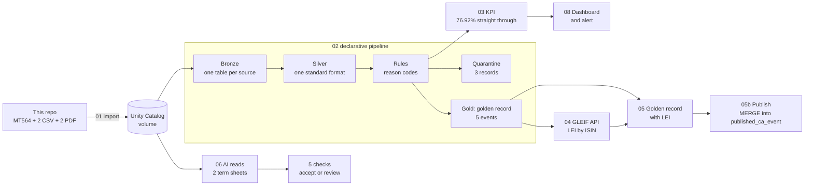

# Corporate actions golden record on Databricks

**The manual work this replaces.** An analyst receives corporate actions from several sources, each in its own format; where the sources report the same event, the analyst compares them field by field, decides which values are right and types the result into the reference data system. Structured product terms are typed in the same way, by reading PDF term sheets. Here the pipeline does that work, and a person only sees the exceptions: 3 of 13 records and 1 of 2 term sheets on the test data.

Three sources report corporate actions in three formats. Their coverage partly overlaps, and where it does, they can disagree. This project builds the pipeline that decides what gets published: it cleans the three feeds, rejects anything that breaks a rule (with the reason attached), picks one golden record per event, measures how much went through without manual work, adds each issuer's LEI from GLEIF's public API, and publishes the result with a MERGE. A second flow uses AI to read PDF term sheets, then five checks decide whether each one is accepted automatically or goes to a person for review.

## What this project shows

- **A manual process automated end to end.** The compare-and-key work on corporate actions runs without a person; only the exceptions reach an analyst, each with its reason. 3 of 13 records on the test data.
- **Data quality controls.** Named rules with reason codes, a quarantine instead of silent drops, reconciliation across sources, an audit trail back to the source files, and monitoring with a dashboard and an alert.
- **Financial instrument data.** Corporate actions (one golden record from three disagreeing sources), reference data (ISIN checks, LEIs from GLEIF) and structured products (term sheets read from PDFs).
- **Business rules turned into technical ones.** Each rule an analyst follows, like "a pay date can't fall before the record date", becomes a named check that anyone can read in the output.
- **AI with controls.** AI reads the PDF term sheets, and five checks decide what is accepted and what goes to review. Nothing the AI extracts is trusted on its own.
- **Built to run every day.** One job runs every step in order and reads only new files; failures are isolated and re-runnable, and every run is measured. A schedule is one setting on the job.
- **Hands-on Databricks.** Lakeflow declarative pipeline, Auto Loader, Lakeflow Jobs, Unity Catalog, Delta Lake, AI Functions, dashboards and alerts, in SQL and Python.

**Walkthrough (three short videos):** LOOM_LINK_1, LOOM_LINK_2, LOOM_LINK_3

Built on Databricks: Lakeflow declarative pipeline, Auto Loader, Unity Catalog, Lakeflow Jobs, AI Functions (`ai_parse_document`, `ai_extract`), Python and SQL.

## How it works

1. **Import.** The source files are copied from this repo into a Unity Catalog volume.
2. **Pipeline, in three layers.** Bronze: each source lands as received, in its own table, so any run can be replayed from the original files. Silver: the three formats become one standard format and every record is checked against the rules; failures go to a quarantine table with their reason codes, nothing is dropped silently. Gold: the golden record, one row per event, taken from the most trusted source (depositary, then issuer, then exchange).
3. **KPI.** The share of records that pass every rule, plus failures by rule.
4. **LEI.** Each golden record's ISIN is looked up in GLEIF's public API, which returns the issuer's LEI and legal name.
5. **Golden record with LEI.** A left join of the two: every golden record with its LEI and legal name. An event without an LEI stays, with the LEI empty.
6. **Publish.** The golden records with their LEI are merged into `published_ca_event`, the table other systems would read. A new event is inserted; an existing one is updated only if its rate, pay date or LEI changed; nothing is deleted. A rerun never duplicates anything, and every change is a new version of the table.
7. **Term sheets.** AI reads two PDF term sheets and extracts ten key terms: issuer, ISIN, product type, currency, coupon, strike, barrier, and the initial fixing, final fixing and redemption dates. Five checks then test what the AI extracted (see [Term sheet checks](#term-sheet-checks)). A term sheet that passes all five is accepted automatically; one that fails any check goes to review, with the reason. A review page shows each PDF with the rows the AI read highlighted, the extracted values, the checks and the verdict.
8. **Monitoring.** A two-page dashboard and an alert (see [Monitoring](#monitoring)).

## How it runs

- **One job, in order.** The steps above run as one Lakeflow Job. Each task starts only when the tasks before it have succeeded, and the publish step runs last, once the KPI and the LEI join are done.
- **Started by hand or on a schedule.** Today it's started with Run now. A schedule, for example weekdays at 18:00, is a setting on the job; its first task then pulls the day's files.
- **Only new data.** Auto Loader remembers which files it has already read, so each run reads only new files and a rerun never duplicates anything.

## Monitoring

- **Dashboard, for the manager.** One page that answers "did today's run work, and what needs a person?": straight-through rate, records in quarantine and golden records at the top; why records failed and where the sources disagree in the middle; the golden records with their LEI at the bottom.
- **Alert, for the team.** After each run, an email goes out if the straight-through rate is below 80%. On the test data it fires (76.92%).
- **Analyst page, for the analysts.** The dashboard's second page: the quarantine queue with the reason for each record, and the events only one source reported.

The SQL for all three is in [`08_monitoring.sql`](08_monitoring.sql).

## Databricks features that make it work

| Feature | What it does here | Why it matters for automating a process |
|---|---|---|
| Lakeflow declarative pipeline | The flow from raw files to golden record, written as SQL tables; Databricks works out the order and runs it | The transformation reads like the business process, with no plumbing code |
| Auto Loader | Picks up only new files, each exactly once | Daily feeds run unattended, with no duplicates |
| Lakeflow Jobs | Runs every step in order on a schedule, with dependencies and repair runs | The manual process becomes a job that runs itself |
| AI Functions (`ai_parse_document`, `ai_extract`) | Read PDF term sheets straight from SQL | The most manual input, documents, enters the same pipeline as the files |
| Unity Catalog | Files, tables, functions and lineage in one governed place | Where every table comes from, and what uses it, is visible |
| Delta Lake | Every table is versioned: history, time travel, restore | Audit trail and recovery come built in |
| Databricks SQL dashboards and alerts | The manager's page, the analysts' page and the team's alert | Monitoring without a separate tool |

## Results on the test data

| Step | Result |
|---|---|
| Records checked | 13 (a record sent twice counts once, latest version) |
| Passed every rule | 10 |
| Quarantined, with reasons | 3 |
| Straight-through rate | 76.92% |
| Golden records | 5 |
| LEIs found in GLEIF | 4 of 5 |
| Term sheets | 1 accepted automatically, 1 sent to review |
| Published | 5 events in `published_ca_event`, with LEI and legal name where found |

**Quarantine**

| Record | Reason code | What is wrong |
|---|---|---|
| ISS-005 | `ISIN_INVALID` | ISIN check digit is wrong (DE0007236102) |
| EXC-002 | `DATE_ORDER` | Pay date falls before the record date |
| EXC-004 | `UNMAPPED_EVENT`, `EX_DATE_WEEKEND` | Event code 90 has no mapping; ex-date is a Sunday |

**Golden records with LEI**

| ISIN | Event | Ex-date | Rate | Winning source | LEI | Legal name (GLEIF) |
|---|---|---|---|---|---|---|
| DE0007236101 | DVCA | 2026-02-13 | EUR 5.35 | Depositary | W38RGI023J3WT1HWRP32 | Siemens Aktiengesellschaft |
| CH0244767585 | DVCA | 2026-04-22 | USD 0.55 | Depositary | 549300SZJ9VS8SGXAN81 | UBS Group AG |
| DE0007164600 | DVCA | 2025-05-14 | EUR 2.35 | Depositary | 529900D6BF99LW9R2E68 | SAP SE |
| DE0008404005 | DVCA | 2026-05-08 | EUR 17.10 | Issuer | 529900K9B0N5BT694847 | Allianz SE |
| LU0290358497 | LIQU | 2026-11-02 | EUR 141.37 | Depositary | not in GLEIF | |

- Siemens: the depositary and the exchange report 5.35, the issuer 5.30. The depositary wins by source priority, and the conflict stays visible in `ca_reconciliation`.
- Allianz: the depositary never reported this dividend, so the issuer's record wins.
- The ETF has no ISIN-to-LEI link in GLEIF. The join keeps the event with an empty LEI instead of dropping it: enrichment never blocks the core record, and the gap stays visible.

**Term sheets**

| Term sheet | Verdict | Why |
|---|---|---|
| TS1, Barrier Reverse Convertible | Accepted automatically | All 5 checks pass |
| TS2, Express Certificate | Sent to review | Barrier 160% is not below the strike 100% |

## Rules

### Corporate action rules

| Code | Rule |
|---|---|
| `ISIN_INVALID` | ISIN fails its ISO 6166 check digit |
| `UNMAPPED_EVENT` | The source's event code has no mapping to an ISO 15022 event type (CAEV) |
| `DATE_MISSING` | Ex-date, record date or pay date missing |
| `DATE_ORDER` | Record date before the ex-date, or pay date before the record date |
| `EX_DATE_WEEKEND` | Ex-date falls on a weekend |
| `RATE_INVALID` | Dividend or liquidation rate missing or not positive |
| `CCY_INVALID` | Currency is not a 3-letter code |

### Term sheet checks

For safety checks, nothing it extracts is accepted until these five checks pass. A term sheet that fails any of them goes to review, with the name of the check it failed.

| Check | What it tests | What it catches |
|---|---|---|
| `ISIN_INVALID` | The ISIN's check digit | One misread character, which gives a wrong ISIN that still looks real |
| `CCY_INVALID` | The currency is a 3-letter code | A garbled or missing currency |
| `COUPON_IMPLAUSIBLE` | The coupon is present and between 0 and 30% a year | A misplaced decimal or a misread number |
| `BARRIER_NOT_BELOW_STRIKE` | The barrier sits below the strike | On these products the barrier is a safety net below the starting price, so a barrier above it is impossible (TS2: 160%) |
| `DATES_MISSING_OR_ORDER` | Initial fixing before final fixing, final fixing no later than redemption | Missing, swapped or misread dates |

## Reconciliation and audit trail

- **Reconciliation.** For every event, `ca_reconciliation` lists what each source reported and flags any disagreement, like Siemens at 5.35 against 5.30. A source that stayed silent shows up too: Allianz has no depositary entry.
- **Audit trail.** Every published value can be traced back. Bronze keeps each file as received, with its file name and load time on every row. Each golden record keeps its winning source and that source's own reference. Quarantined records keep their reasons. The KPI table keeps one row per run. The published table changes only through the MERGE, so its history shows every insert and update. Delta keeps every version of every table, so any earlier state can be viewed or restored.

## Data

- **Three sources, three formats.** Depositary: SWIFT MT564 messages. Issuer: CSV with semicolons, decimal commas and dd/MM/yyyy dates. Exchange: CSV with yyyyMMdd dates and numeric event codes.
- **Real dividends.** Siemens EUR 5.35 ([DividendMax](https://www.dividendmax.com/germany/frankfurt-stock-exchange/electronic-and-electrical-equipment/siemens-ag/dividends)), SAP EUR 2.35 ([SAP press release](https://news.sap.com/2025/02/sap-proposes-dividend-for-fiscal-year-2024/)), UBS USD 0.55 ([StockAnalysis](https://stockanalysis.com/stocks/ubs/dividend/)), Allianz EUR 17.10 ([StockAnalysis](https://stockanalysis.com/quote/fra/ALV/dividend/)).
- **Planted defects** on top of the real events: a rate conflict between sources, a record resent with a corrected pay date, a trailing space in an ISIN and a lowercase currency, a wrong ISIN check digit, a pay date before the record date, an unmapped event code, a Sunday ex-date, and an event missing from the depositary.
- **The ETF liquidation** (LU0290358497) is a synthetic test case; the fund has not been liquidated.
- **Term sheets** are two synthetic PDFs: fictional issuer, invented ISINs, real underlyings (Nestlé, Novartis, Roche). TS2 carries a deliberate error, a 160% barrier.
- **`instruments/`** holds two daily instrument snapshots for instrument-history work; this pipeline does not use them.

## Design choices

- **Reason codes, not true/false.** A record can fail several rules at once; the codes tell an analyst what to fix and feed the KPI.
- **Reference data defined once.** Event-code mapping, source priority and the ISIN check are Unity Catalog objects, created once rather than rebuilt on every run.
- **Enrichment never blocks.** A missing LEI leaves a visible gap, not a failed run.
- **AI output is never trusted on its own.** Extraction is followed by rules, and anything that fails goes to review.
- **Currency kept as reported.** UBS stays in USD; FX conversion is out of scope.
- **Publish only what changed.** The MERGE inserts new events and updates an existing one only when its rate, pay date or LEI changed, so downstream systems see real changes only.
- **Reusable by configuration.** Reusable as it is for cash events; for other event families, the same pipeline gets new fields, its own rule set and a different value to compare, and everything else stays.

## How to run

Databricks Free Edition (serverless), catalog `workspace`, schema `six_data`.

1. Run `00_setup.sql` once.
2. Run `01_import_files.py` to copy the source files into the volume.
3. Create a Lakeflow declarative pipeline with `02_ca_pipeline.sql` as its source.
4. Create a job: import, then the pipeline, then `03_dq_kpi.sql` and `04_lei_enrichment.py`, then `05_gold_ca_event_lei.sql` after the LEI task, and `05b_publish_ca_event.py` last, after the KPI and the join. Optionally, schedule it for weekdays at 18:00.
5. Term sheets: run `06_term_sheet_extraction.sql`, then `07_term_sheet_review.py` (needs `pymupdf` in the notebook environment).
6. Monitoring: build the two-page dashboard and the alert from `08_monitoring.sql`.

## Limits

Synthetic defects on real events, three sources, and two synthetic term sheets rather than a labelled accuracy set. A standalone build, not connected to any production system. The event key (ISIN, event type, ex-date) would merge a regular and a special dividend paid with the same ex-date; a production version would match on the official event reference (`:20C::COAF` in MT564).

## Repository

| File or folder | What it holds |
|---|---|
| [`00_setup.sql`](00_setup.sql) | Schema, volumes, event-code mapping, source priority, ISIN check |
| [`01_import_files.py`](01_import_files.py) | Copies the source files from this repo into the volume |
| [`02_ca_pipeline.sql`](02_ca_pipeline.sql) | The pipeline: bronze, silver, rules, quarantine, golden record, reconciliation |
| [`03_dq_kpi.sql`](03_dq_kpi.sql) | Straight-through rate and failures by rule |
| [`04_lei_enrichment.py`](04_lei_enrichment.py) | LEI lookup from GLEIF's public API by ISIN |
| [`05_gold_ca_event_lei.sql`](05_gold_ca_event_lei.sql) | Golden record joined with its LEI and legal name |
| [`05b_publish_ca_event.py`](05b_publish_ca_event.py) | Publishes the golden records with their LEI into `published_ca_event` with a MERGE |
| [`06_term_sheet_extraction.sql`](06_term_sheet_extraction.sql) | AI extraction from the PDFs, the five checks, routing |
| [`07_term_sheet_review.py`](07_term_sheet_review.py) | Review page: PDF, extracted values, checks, verdict |
| [`08_monitoring.sql`](08_monitoring.sql) | Datasets for both dashboard pages, and the alert query |
| `depositary/`, `issuer/`, `exchange/` | Source files for the pipeline |
| `instruments/` | Two daily instrument snapshots (not used by the pipeline) |
| `term_sheets/` | Two synthetic PDF term sheets |
