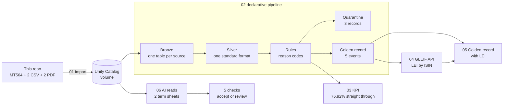

# Corporate actions golden record on Databricks

Three sources report the same corporate actions and disagree with each other. This project builds the pipeline that decides what gets published: it cleans the three feeds, rejects anything that breaks a rule (with the reason attached), picks one golden record per event, measures how much went through without manual work, and adds each issuer's LEI from GLEIF's public API. A second flow uses AI to read PDF term sheets, then five checks decide whether each one is accepted automatically or goes to a person for review.

**Walkthrough video (5 min):** LOOM_LINK

Built on Databricks: Lakeflow declarative pipeline, Auto Loader, Unity Catalog, Lakeflow Jobs, AI Functions (`ai_parse_document`, `ai_extract`), Python and SQL.

## How it works

1. **Import.** The source files are copied from this repo into a Unity Catalog volume.
2. **Pipeline.** Each source lands raw in its own bronze table, is converted to one standard format in silver, then checked against the rules. Failures go to a quarantine table with their reason codes; nothing is dropped silently. The golden record takes each event from the most trusted source (depositary, then issuer, then exchange).
3. **KPI.** The share of records that pass every rule, plus failures by rule.
4. **LEI.** Each golden record's ISIN is looked up in GLEIF's public API, which returns the issuer's LEI and legal name.
5. **Golden record with LEI.** A join of the two, run as its own job task after both.
6. **Term sheets.** AI reads two PDF term sheets and extracts ten key terms: issuer, ISIN, product type, currency, coupon, strike, barrier, and the initial fixing, final fixing and redemption dates. Five checks then test what the AI extracted (see [Term sheet checks](#term-sheet-checks)). A term sheet that passes all five is accepted automatically; one that fails any check goes to review, with the reason. A review page shows each PDF with the rows the AI read highlighted, the extracted values, the checks and the verdict.

## Results on the test data

| Step | Result |
|---|---|
| Records checked | 13 (a record sent twice counts once, latest version) |
| Passed every rule | 10 |
| Quarantined, with reasons | 3 |
| Straight-through rate | 76.92% |
| Golden records | 5 |
| LEIs found in GLEIF | 4 of 5 |
| Term sheets | 1 accepted automatically, 1 sent to review |

**Quarantine**

| Record | Reason code | What is wrong |
|---|---|---|
| ISS-005 | `ISIN_INVALID` | ISIN check digit is wrong (DE0007236102) |
| EXC-002 | `DATE_ORDER` | Pay date falls before the record date |
| EXC-004 | `UNMAPPED_EVENT`, `EX_DATE_WEEKEND` | Event code 90 has no mapping; ex-date is a Sunday |

**Golden records with LEI**

| ISIN | Event | Ex-date | Rate | Winning source | LEI | Legal name (GLEIF) |
|---|---|---|---|---|---|---|
| DE0007236101 | DVCA | 2026-02-13 | EUR 5.35 | Depositary | W38RGI023J3WT1HWRP32 | Siemens Aktiengesellschaft |
| CH0244767585 | DVCA | 2026-04-22 | USD 0.55 | Depositary | 549300SZJ9VS8SGXAN81 | UBS Group AG |
| DE0007164600 | DVCA | 2025-05-14 | EUR 2.35 | Depositary | 529900D6BF99LW9R2E68 | SAP SE |
| DE0008404005 | DVCA | 2026-05-08 | EUR 17.10 | Issuer | 529900K9B0N5BT694847 | Allianz SE |
| LU0290358497 | LIQU | 2026-11-02 | EUR 141.37 | Depositary | not in GLEIF | |

- Siemens: the depositary and the exchange report 5.35, the issuer 5.30. The depositary wins by source priority, and the conflict stays visible in `ca_reconciliation`.
- Allianz: the depositary never reported this dividend, so the issuer's record wins.
- The ETF has no ISIN-to-LEI link in GLEIF. The join keeps the event with an empty LEI instead of dropping it: enrichment never blocks the core record, and the gap stays visible.

**Term sheets**

| Term sheet | Verdict | Why |
|---|---|---|
| TS1, Barrier Reverse Convertible | Accepted automatically | All 5 checks pass |
| TS2, Express Certificate | Sent to review | Barrier 160% is not below the strike 100% |

## Rules

### Corporate action rules

| Code | Rule |
|---|---|
| `ISIN_INVALID` | ISIN fails its ISO 6166 check digit |
| `UNMAPPED_EVENT` | The source's event code has no mapping to an ISO 15022 event type (CAEV) |
| `DATE_MISSING` | Ex-date, record date or pay date missing |
| `DATE_ORDER` | Record date before the ex-date, or pay date before the record date |
| `EX_DATE_WEEKEND` | Ex-date falls on a weekend |
| `RATE_INVALID` | Dividend or liquidation rate missing or not positive |
| `CCY_INVALID` | Currency is not a 3-letter code |

### Term sheet checks

AI can misread a value, so nothing it extracts is accepted until these five checks pass. A term sheet that fails any of them goes to review, with the name of the check it failed.

| Check | What it tests | What it catches |
|---|---|---|
| `ISIN_INVALID` | The ISIN's check digit | One misread character, which gives a wrong ISIN that still looks real |
| `CCY_INVALID` | The currency is a 3-letter code | A garbled or missing currency |
| `COUPON_IMPLAUSIBLE` | The coupon is present and between 0 and 30% a year | A misplaced decimal or a misread number |
| `BARRIER_NOT_BELOW_STRIKE` | The barrier sits below the strike | On these products the barrier is a safety net below the starting price, so a barrier above it is impossible (TS2: 160%) |
| `DATES_MISSING_OR_ORDER` | Initial fixing before final fixing, final fixing no later than redemption | Missing, swapped or misread dates |

## Data

- **Three sources, three formats.** Depositary: SWIFT MT564 messages. Issuer: CSV with semicolons, decimal commas and dd/MM/yyyy dates. Exchange: CSV with yyyyMMdd dates and numeric event codes.
- **Real dividends.** Siemens EUR 5.35 ([DividendMax](https://www.dividendmax.com/germany/frankfurt-stock-exchange/electronic-and-electrical-equipment/siemens-ag/dividends)), SAP EUR 2.35 ([SAP press release](https://news.sap.com/2025/02/sap-proposes-dividend-for-fiscal-year-2024/)), UBS USD 0.55 ([StockAnalysis](https://stockanalysis.com/stocks/ubs/dividend/)), Allianz EUR 17.10 ([StockAnalysis](https://stockanalysis.com/quote/fra/ALV/dividend/)).
- **Planted defects** on top of the real events: a rate conflict between sources, a record resent with a corrected pay date, a trailing space in an ISIN and a lowercase currency, a wrong ISIN check digit, a pay date before the record date, an unmapped event code, a Sunday ex-date, and an event missing from the depositary.
- **The ETF liquidation** (LU0290358497) is a synthetic test case; the fund has not been liquidated.
- **Term sheets** are two synthetic PDFs: fictional issuer, invented ISINs, real underlyings (Nestlé, Novartis, Roche). TS2 carries a deliberate error, a 160% barrier.
- **`instruments/`** holds two daily instrument snapshots for instrument-history work; this pipeline does not use them.

## Design choices

- **Reason codes, not true/false.** A record can fail several rules at once; the codes tell an analyst what to fix and feed the KPI.
- **Reference data defined once.** Event-code mapping, source priority and the ISIN check are Unity Catalog objects, created once rather than rebuilt on every run.
- **Enrichment never blocks.** A missing LEI leaves a visible gap, not a failed run.
- **AI output is never trusted on its own.** Extraction is followed by rules, and anything that fails goes to review.
- **Currency kept as reported.** UBS stays in USD; FX conversion is out of scope.

## How to run

Databricks Free Edition (serverless), catalog `workspace`, schema `six_data`.

1. Run `00_setup.sql` once.
2. Run `01_import_files.py` to copy the source files into the volume.
3. Create a Lakeflow declarative pipeline with `02_ca_pipeline.sql` as its source.
4. Create a job: import, then the pipeline, then `03_dq_kpi.sql` and `04_lei_enrichment.py`; `05_gold_ca_event_lei.sql` depends on both the pipeline and the LEI task.
5. Term sheets: run `06_term_sheet_extraction.sql`, then `07_term_sheet_review.py` (needs `pymupdf` in the notebook environment).

## Limits

Synthetic defects on real events, three sources, and two synthetic term sheets rather than a labelled accuracy set. A standalone build, not connected to any production system.

## Repository

| File or folder | What it holds |
|---|---|
| [`00_setup.sql`](00_setup.sql) | Schema, volumes, event-code mapping, source priority, ISIN check |
| [`01_import_files.py`](01_import_files.py) | Copies the source files from this repo into the volume |
| [`02_ca_pipeline.sql`](02_ca_pipeline.sql) | The pipeline: bronze, silver, rules, quarantine, golden record, reconciliation |
| [`03_dq_kpi.sql`](03_dq_kpi.sql) | Straight-through rate and failures by rule |
| [`04_lei_enrichment.py`](04_lei_enrichment.py) | LEI lookup from GLEIF's public API by ISIN |
| [`05_gold_ca_event_lei.sql`](05_gold_ca_event_lei.sql) | Golden record joined with its LEI |
| [`06_term_sheet_extraction.sql`](06_term_sheet_extraction.sql) | AI extraction from the PDFs, the five checks, routing |
| [`07_term_sheet_review.py`](07_term_sheet_review.py) | Review page: PDF, extracted values, checks, verdict |
| `depositary/`, `issuer/`, `exchange/` | Source files for the pipeline |
| `instruments/` | Two daily instrument snapshots (not used by the pipeline) |
| `term_sheets/` | Two synthetic PDF term sheets |
